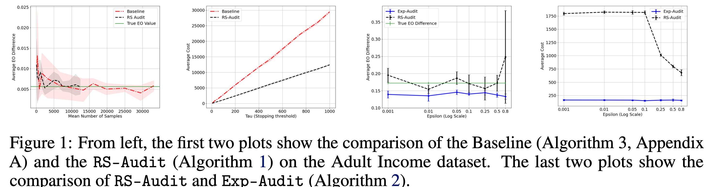

## Installation
The code base has dependency on basic packages listed in [requirements.txt](./requirements.txt). It can be installed via the following command:
```
$ pip install -r requirements.txt 
```

## Usage
This code base implements `RS-Audit` (Algorithm 1 in the paper), Algorithm 3 in the paper and `Exp-Audit` (Algorithm 2 in the paper). All codes are present under the folder [experiments](./experiments).



